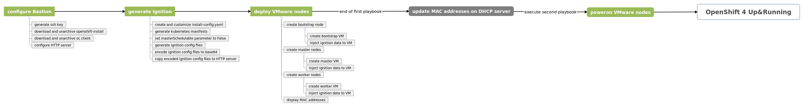

# OCP 4 install on VMware

## vSphere preparation

- download [RHCOS OVA](https://mirror.openshift.com/pub/openshift-v4/dependencies/rhcos/4.2/4.2.0/rhcos-4.2.0-x86_64-vmware.ova)

- create new folder with the name of the OCP cluster

- import OVA in vSphere (make sure the imported OVA is a VMware template)

## Bastion server

- create a VMware VM

- install OS

- configure proxy (to get access on Internet)

- install Ansible on this server

```shell
pip install ansible
```

- install `pyvmomi` library

```shell
pip3 install pyvmomi
```

## Automation workflow

[Here](./images/ocp4_-_automation_workflow.png) is the complete workflow to install OpenShift 4 on VMware infrastructure.



**NB**: All steps are automated with Ansible. Only the task `update MAC addresses on DHCP server` must be done manually.

## Using Ansible playbook

- clone this git repository

```shell
git clone https://github.com/bmangoen/openshift-hybrid-install.git
```

- go to the `openshift-hybrid-install/ansible` directory and create extra_vars file (you could use this [example](../ansible/extra_vars/example.yaml))

```shell
cd openshift-hybrid-install/ansible && cp extra_vars/example.yaml extra_vars/ocp_install.yaml
```

- replace with the right values into this copied `extra_vars/ocp_install.yaml` file

```shell
vi extra_vars/ocp_install.yaml
```

- and execute `install_openshift` playbook by also specified the extra_vars file

```shell
ansible-playbook playbooks/install_openshift.yaml -e @extra_vars/ocp_install.yaml -e 'ansible_python_interpreter=/usr/bin/python3'
```

## Update the MAC addresses of nodes into DHCP server

After the execution of the playbook, the MAC addresses of the cluster nodes will be displayed.
You have to copy/paste them and update the DHCP server.

## Poweron the nodes

Execute `vmware_poweron_openshift_nodes` playbook

```shell
ansible-playbook playbooks/vmware_poweron_openshift_nodes.yaml -e @extra_vars/ocp_install.yaml
```

From this stage, the bootstrap starts.

## Cluster installation

### Monitor the bootsrap process

```shell
openshift-install --dir working_installer_dir wait-for bootstrap-complete --log-level debug
```

**NB**: The bootstrap is finished when there is the message `DEBUG Bootstrap status: complete`. You can safely delete the bootstrap node at this step.

### Login to the cluster

- export `KUBECONFIG` to use `oc` client

```shell
export KUBECONFIG=working_installer_dir/auth/kubeconfig
```

### Approving CSRs

- confirm that the cluster recognizes the machines

```shell
oc get nodes
```

- review the status of approval CSRs

```shell
oc get csr
```

- if the CSRs were not approved, after all of the pending CSRs for the machines you added are in *Pending* status, approve the CSRs for your cluster machines

```shell
oc get csr --no-headers | awk '{print $1}' | xargs oc adm certificate approve
```

### Image registry storage configuration

- modify the storage specification of `configs.imageregistry.operator.openshift.io/cluster`

  - for non-production environment, you can use non-persistent volume:

```shell
oc patch configs.imageregistry.operator.openshift.io cluster --type merge --patch '{"spec":{"storage":{"emptyDir":{}}}}'
```

  - for production environment:

```shell
oc patch configs.imageregistry.operator.openshift.io cluster --type merge --patch '{"spec":{"pvc":{"claim":}}}'
```


Leave the `claim` filed blank to allow the automatic creation of an `image-registry-storage` PVC.

- check the clusteroperator status

```shell
oc get clusteroperator image-registry
```

### Completing installation

Check the status of the cluster installation.

```shell
openshift-install --dir ocp-vsphere wait-for install-complete --log-level debug
```
